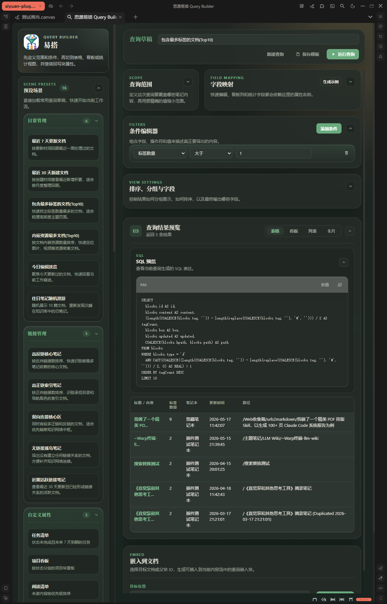

# 易搭 Query Builder

**为思源笔记用户设计的可视化查询构建器** — 无需懂 SQL，无需写代码，点几下就能把笔记整理成任务清单、项目看板或知识仪表盘。

---

## 你是否遇到过这些困扰？

- 笔记越记越多，却找不到想看的内容
- 知道思源"可以查询"，但不会写 SQL，不知道从哪下手
- 查出来的结果只是一堆原始块，看着费劲，也无法直接操作
- 同样的查询每次都要重新设置，反复做重复劳动

**易搭 Query Builder 就是为解决这些问题而生的。**

---

## 核心价值

### 🖱️ 可视化配置，无需任何代码

通过界面点选完成查询条件设置——选范围、定条件、加排序、分组，插件自动生成 SQL，你只需专注"想看什么"。

### 📋 16 个预置场景，开箱即用

无需从零开始。插件内置涵盖日常管理、链接管理、自定义属性等分类的 **16 个常用查询场景**，点击即载入，一键运行。

| 分类 | 预置场景示例 |
|------|------------|
| 日常管理 | 最近 7 天更新文档、今日编辑速览、往日笔记随机漫游… |
| 链接管理 | 高反链核心笔记、高正向引链笔记、双向连接核心区… |
| 自定义属性 | 任务清单、项目看板、阅读清单… |

### 📊 四种结果视图，按需切换

同一份查询结果，可以在**表格、看板、列表、统计卡片**四种视图之间随意切换，找到最适合自己场景的展示方式。

### ✏️ 结果可直接操作

在视图中直接修改状态、日期、优先级等属性，无需跳转到原始块，改动实时回写到笔记。

### 🔗 嵌入文档，随处可用

将查询结果以**嵌入块**形式插入任意文档，或在文档内按模板配置进行行内渲染，打造个人专属工作台。

---

## 典型使用场景

### 场景一：本周任务清单

> "我想看所有状态为未完成、截止日期在本周内的任务"

在侧边栏选择"任务清单"预置，或手动配置：选块类型 → 添加条件"状态 ≠ 已完成"+"截止日期 ≤ 本周日" → 选表格视图。结果出来后直接在表格里改状态，不用打开每个块。

### 场景二：项目看板

> "我想把所有带项目标签的块，按状态分成待办 / 进行中 / 已完成三列"

设置查询范围 → 按"状态"字段分组 → 切换到看板视图。卡片按状态归列展示，进度一目了然。

### 场景三：会议记录回顾

> "最近一个月的会议记录，按项目归类，方便回顾"

设置时间范围条件为"最近 30 天" → 按"项目"属性分组 → 保存为模板，下次直接复用。

### 场景四：知识盘点

> "找出最近新增但还没有建立任何引用关系的内容"

使用"无链接孤鸟笔记"预置场景，一键找出知识库中尚未建立联系的孤立内容，方便后续整理和关联。

---

## 与 sy-query-view 的对比

[sy-query-view](https://github.com/frostime/sy-query-view) 是思源生态中另一款优秀的查询插件，两者定位有所不同：

| 对比维度 | 易搭 Query Builder | sy-query-view |
|---------|-------------------|---------------|
| **使用门槛** | 无需 SQL / JavaScript | 需要编写 JavaScript 代码 |
| **上手方式** | 可视化点选配置，16 个预置场景 | 手写代码，需阅读 API 文档 |
| **结果视图** | 表格、看板、列表、统计卡片（独立面板） | 代码驱动的自定义 DataView |
| **属性回写** | ✅ 直接在视图内编辑状态/日期/优先级 | ✗ 通常只读展示 |
| **嵌入文档** | ✅ 支持嵌入块 + 行内渲染 | ✅ 支持嵌入块渲染 |
| **灵活度** | 覆盖绝大多数日常场景 | 几乎无上限，可实现任意自定义逻辑 |
| **适合人群** | 不懂代码的普通用户、效率工具爱好者 | 有编程能力的进阶用户、开发者 |

> **总结：** 如果你不想写代码、希望快速搭建可用的查询视图，易搭 Query Builder 是更低门槛的选择；如果你熟悉 JavaScript 并需要高度定制化的查询逻辑，sy-query-view 提供了更强的自由度。两者各有侧重，并不冲突。

---

## 主要功能一览

- **查询构建器**：可视化配置查询范围、筛选条件、排序、分组、输出字段
- **预置场景库**：16 个常用场景，涵盖日常管理、知识整理、项目追踪
- **多视图结果面板**：表格 / 看板 / 列表 / 统计卡片，自由切换
- **查询模板**：保存查询配置，支持在同一模板下维护多个视图
- **属性快速回写**：在视图中直接编辑状态、日期、优先级字段
- **嵌入到文档**：将查询结果生成为嵌入块插入文档，支持行内渲染
- **SQL 预览**：可折叠查看当前查询生成的 SQL，满足进阶用户的透明度需求

---

## 系统要求

- 思源笔记 ≥ 2.10.14
- 支持平台：Windows / Linux / macOS / Docker（桌面端）

---

## 许可证

[MIT License](LICENSE)
