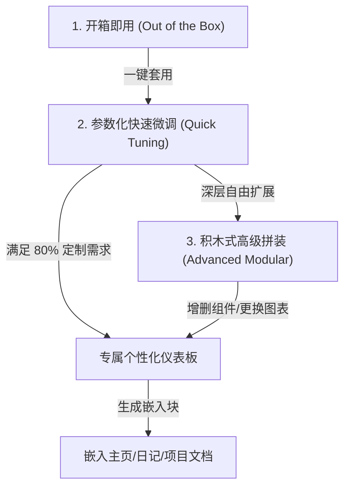
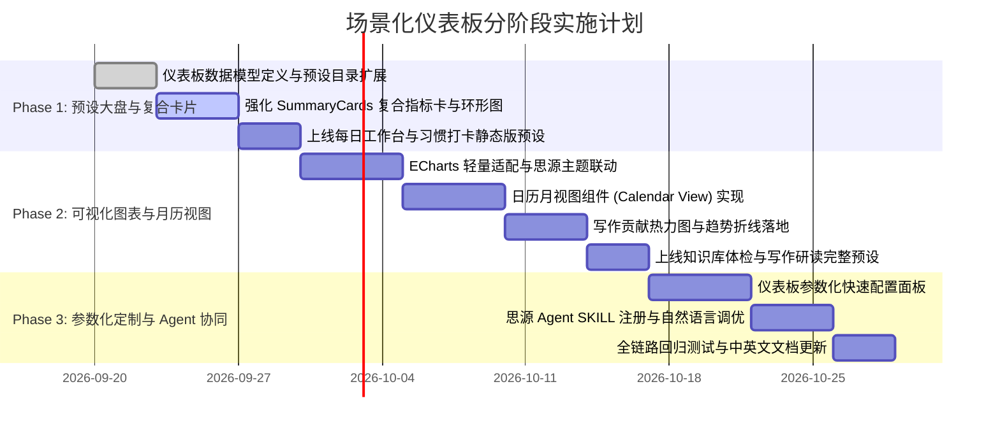

# 易搭 Query Builder 场景化仪表板规划与设计方案建议

> **版本**：v1.0  
> **状态**：规划与设计阶段  
> **输出文件**：`docs/scenario-dashboard-design-plan.md`  
> **参考来源**：
> - [Query View 2.0 更新 \| 原生支持思源 Agent](https://ld246.com/article/1789127075766)
> - [Query & View 模板分享：喝水统计](https://ld246.com/article/1789231687227)
> - [利用 Query & View 插件做简单的日志事项管理](https://ld246.com/article/1789609398374)

---

## 1. 背景与核心设计理念

### 1.1 社区参考实践复盘与启发

思源笔记拥有强大的底层 SQLite 数据库和块级细粒度属性体系。链滴社区近期关于数据视图与仪表盘的三篇标杆实践为我们展示了非常清晰的高价值方向：

1. **Query View 2.0（原生 Agent + 复合型仪表盘）**：
   - **复合呈现**：在单个嵌入块中同时呈现**“数字 KPI 卡 + 趋势折线图 + 分类柱状图 + 核心明细表”**，实现全库资产体检。
   - **交互联动**：GitHub 风格的**日历贡献热力图**支持点击单元格下钻，动态展开当天产出文档。
   - **AI 赋能**：内置 Agent SKILL 规范，通过向思源内置 Agent 暴露标准 API 签名，让普通用户可以通过自然语言对话生成或调整查询块。
2. **喝水统计模板（微习惯打卡与多维复盘大盘）**：
   - **即时激励**：环形进度达成卡（Conic Gradient）直观展示今日打卡进度，连续达标天数（Streak）带来强烈正向心理反馈。
   - **全景洞察**：将单一数据源（日记中的特定词条）拆解为 7 日移动平均趋势、星期均值对比、达标分桶分布、周末与工作日差异、月度达标率复盘等 8 种图表。
   - **时间切片**：支持在“全部”和“特定月份”之间平滑切换。
3. **日志事项管理（月历视图与日志工作流结合）**：
   - **时间感知**：以传统的月历网格形式聚合所有日记中的待办/进行中/延期/完成任务。
   - **轻量交互**：提供日期未完成标记横线、每天超过限额时的“+N”悬浮气泡、快捷搜索与状态一键过滤。
   - **无缝回跳**：点击任务卡片直达源块，点击日期直达对应日记。

### 1.2 易搭 Query Builder 的破局点与演进目标

| 维度 | 传统手写代码/脚本方案（如 Query & View） | 易搭 Query Builder 演进方案 |
| :--- | :--- | :--- |
| **使用门槛** | 极高，需要精通 SQL、JS DOM 操作、ECharts 配置 | **零代码/低代码**，像搭积木一样点选，所见即所得 |
| **个性化成本** | 改一个字段或阈值需逐行阅读源码并修改 | **参数化配置面板**，改笔记本、改关键词、改目标值一键完成 |
| **数据回写** | 多数为只读展示，无法直接在视图中改变数据 | **双向数据同步**，在仪表板中勾选任务、改状态实时回写块属性 |
| **架构组织** | 目前易搭以“单查询-单视图（表格/看板/列表/简易卡片）”为主 | 演进为**“场景化复合仪表板（指标卡+多维图表+月历/看板+明细清单）”** |

**核心演进原则**：
- **场景实用性第一**：不堆砌无意义图表，每一个指标和图表都对应真实场景的决策或行动。
- **允许用户基于示例修改**：提供优质预设看板作为“母版”，用户可以一键套用，并基于界面表单微调参数，搭出自己的专属看板。
- **遵循现有架构平滑扩展**：复用现有 `QueryTemplate`、`ViewConfig`、`InlineQueryWidget` 等核心体系，以“复合容器”与“新视图类型”渐进式推进。

---

## 2. 五大开箱即用场景化仪表板方案设计

针对思源用户的核心高频场景（每日行动、习惯培养、数字资产、创作研读、目标交付），设计 5 个深度打磨的场景化仪表板。

```
┌─────────────────────────────────────────────────────────────────────────────┐
│                       易搭场景化仪表板矩阵 (Dashboard Matrix)                  │
├──────────────────────┬──────────────────────┬───────────────────────────────┤
│ 个人生产力与行动流    │ 个人成长与微习惯      │ 知识资产与宏观洞察             │
│ 1. 个人每日工作台     │ 2. 习惯打卡与精力大盘 │ 3. 知识库全景体检大盘          │
├──────────────────────┴──────────────────────┼───────────────────────────────┤
│ 创作与深度研读                              │ 协作与目标交付                 │
│ 4. 创作者写作热力与阅读流转看板              │ 5. 敏捷项目与 OKR 追踪看板     │
└─────────────────────────────────────────────┴───────────────────────────────┘
```

---

### 2.1 仪表板一：个人每日工作台 (Daily Log & Task Cockpit)

#### 场景与用户价值
- **目标人群**：每日在日记（Daily Notes）或各类文档中随手记录任务、但经常遗漏事项的知识工作者。
- **用户痛点**：任务散落在各篇文档中，无法一眼掌握“今天必须做什么”、“过去遗留了什么”，传统任务列表缺乏时间月历感知。
- **核心价值**：将今日待办、近期逾期、日程月历、高优先级清单合一，打造每日打开思源必看的晨间工作台，支持直接在卡片上勾选完成并回写。

#### 界面结构与布局
```
┌─────────────────────────────────────────────────────────────────────────────┐
│  个人每日工作台                                               [ 2026-09-17 ] │
├───────────────────┬───────────────────┬───────────────────┬─────────────────┤
│   今日待办: 6 项   │   进行中: 2 项    │   已完成: 75%     │   延期/逾期: 1  │
├───────────────────┴───────────────────┴───────────────────┴─────────────────┤
│  [月历视图] 本月日程与任务热点 (带未完成短线标记)                [全部|未完成|已完成] │
│  ┌─────┬─────┬─────┬─────┬─────┬─────┬─────┐                                │
│  │ 一  │ 二  │ 三  │ 四  │ 五  │ 六  │ 日  │                                │
│  ├─────┼─────┼─────┼─────┼─────┼─────┼─────┤                                │
│  │ 14  │ 15  │ 16  │ 17★ │ 18  │ 19  │ 20  │                                │
│  │ · 2 │ · 4 │ · 1 │ · 6 │     │     │     │                                │
│  └─────┴─────┴─────┴─────┴─────┴─────┴─────┘                                │
├──────────────────────────────────────┬──────────────────────────────────────┤
│  🎯 今日核心与高优先级事项 (清单/看板)   │  ⏳ 待办事项快速回写区 (支持直接勾选)    │
│  - [ ] 方案评审准备 (高优 · 10:00)    │  - [ ] 晨会记录归档                  │
│  - [/] 易搭仪表板规划文档输出          │  - [x] 发送周报邮件                  │
└──────────────────────────────────────┴──────────────────────────────────────┘
```

#### 关键组成模块与数据逻辑
1. **顶部指标卡组 (Metric Cards)**：
   - 今日到期待办数（`dueDate = today AND status != 'Done'`）
   - 进行中任务数（`status = 'Doing'`）
   - 今日完成率（`Done / (Total - Canceled)`）
   - 历史遗留逾期数（`dueDate < today AND status in ('Todo', 'Doing')`）
2. **中心模块：任务月历 (Calendar View)**：
   - 数据聚合：将任务文档的 `hpath`（或日记属性 `custom-dailynote-*`）中的日期映射到日历单元格；
   - 视觉增强：单元格下方呈现小圆点/色块表示任务密度，存在未完成事项时呈现彩色下划短横线；
   - 交互：点击某天，右侧/下方联动展示当天任务清单；悬浮在 `+N` 时呼出悬浮卡片；
3. **底部模块：今日任务清单与快速回写**：
   - 支持点击 checkbox 直接切换状态为 `Done`，利用现有 `updateBlockAttribute` 机制即时写回思源。

#### 示例个性化配置项 (用户可调参数)
- **任务笔记本范围**：默认为全部笔记本，可指定为“工作”或“日常”；
- **任务标记规则**：支持标准 Markdown 任务列表 `[ ]`，或自定义属性 `custom-status`；
- **是否显示已完成**：一键切换是否归档隐藏完成项。

---

### 2.2 仪表板二：个人习惯打卡与精力节奏大盘 (Habit & Rhythm Tracker)

#### 场景与用户价值
- **目标人群**：习惯践行者（追踪喝水、晨跑、冥想、背单词、少糖、专注阅读等）。
- **用户痛点**：为了打卡不得不使用第三方移动 App，数据无法沉淀在思源本地；在笔记里记了打卡又缺乏长期的可视化成就感反馈。
- **核心价值**：参考链滴“喝水统计”的精华，零代码复刻专业习惯仪表板。通过环形进度、Streak 连续达标、日历热力图与周中规律分析，帮助用户形成稳定的行为节奏。

#### 界面结构与布局
```
┌─────────────────────────────────────────────────────────────────────────────┐
│  习惯追踪：每日饮水 8 杯                            [本月视图 ▼] [目标: 8次] │
├──────────────────────────────────────┬──────────────────────────────────────┤
│  [环形进度卡]                         │  [连续打卡统计卡]                     │
│      ╭─────╮   今日进度: 6/8 杯       │   🔥 当前连续达标: 12 天              │
│     │ 75%   │  差 2 次达标            │   🏆 历史最长连续: 28 天              │
│      ╰─────╯   今日状态: 进行中        │   📅 本月达标率: 86.7% (26/30天)      │
├──────────────────────────────────────┴──────────────────────────────────────┤
│  [打卡贡献热力图] 近 30 天打卡分布 (GitHub 风格，深浅表示打卡次数)            │
│  [■][■][■][■][■][■][■] ... 点击某一天可展开当天打卡记录                      │
├──────────────────────────────────────┬──────────────────────────────────────┤
│  [7 日均值与每日走势折线图]            │  [星期分布柱状图] (发现哪天容易懈怠)  │
│  波浪线呈现波动，虚线表示目标阈值 8   │  周一至周日各天平均达标情况          │
└──────────────────────────────────────┴──────────────────────────────────────┘
```

#### 关键组成模块与数据逻辑
1. **今日进度环与 Streak 卡片**：
   - 环形图采用 CSS `conic-gradient` 或 ECharts Gauge/Pie，动态渲染百分比；
   - 算法计算：基于日记数据，从今日倒序计算 `curStreak`（连续达到目标的连续天数）与 `maxStreak`。
2. **打卡日历热力图 (Heatmap)**：
   - 基于 `blocks.content LIKE '%${keyword}%'` 或打卡属性；
   - 按天聚合计算频次，分级呈现 4 档颜色阶梯（0次/偏少/适中/达标）。
3. **星期与周期分析图表**：
   - 统计周一至周日的均值，提示用户如“周五打卡率最低，需注意保持节奏”。

#### 示例个性化配置项 (用户可调参数)
- **习惯关键词/标签**：例如 `喝水`、`#打卡/跑步`、`阅读`；
- **达标目标数值**：例如每天 `8` 次、或 `30` 分钟；
- **打卡统计口径**：按段落出现次数统计，或按行内数字属性累加。

---

### 2.3 仪表板三：知识库全景体检与脉络大盘 (Knowledge Base Health & Hub)

#### 场景与用户价值
- **目标人群**：长期使用思源笔记的重度用户、卡片盒笔记践行者、个人知识库管理员。
- **用户痛点**：笔记记了成百上千篇，但不知道知识库的实际规模、增长趋势、双链连接健康度，存在大量缺乏反链的“孤鸟笔记”和从未复习的“僵尸笔记”。
- **核心价值**：全库宏观体检，一键盘活数字资产，让用户清楚看到核心知识节点、发现未链接的沉睡笔记并引导关联。

#### 界面结构与布局
```
┌─────────────────────────────────────────────────────────────────────────────┐
│  知识库资产全景大盘                                      [全库范围] [刷新]  │
├─────────────┬─────────────┬─────────────┬─────────────┬─────────────────────┤
│  文档: 1,280│  总块数: 4.8万│  双链数: 3,420│ 标签数: 156 │ 孤鸟文档: 84 (6.5%) │
├─────────────┴─────────────┴─────────────┴─────────────┴─────────────────────┤
│  [近 12 个月新建趋势折线] (记录知识增长曲线)  │ [各笔记本规模横向柱图 Top 8]        │
│  📈 持续攀升，近 3 个月平均每月新建 120 篇   │  📊 工作笔记 (450) / 读书 (320)... │
├─────────────────────────────────────────────┴─────────────────────────────┤
│  [核心枢纽文档 Top 10] (被引用最多的核心知识主干)                           │
│  1. 《前端工程化知识架构》 (38 次反链)                                      │
│  2. 《产品设计原则清单》   (29 次反链)                                      │
├─────────────────────────────────────────────────────────────────────────────┤
│  [孤鸟笔记清理/连接池] (无正向引链且无反链的短文档，点击直接打开处理)        │
│  - [ ] 临时记录-待整理想法 (2026-08-12)                                     │
│  - [ ] 某个会议速记片段   (2026-07-29)                                     │
└─────────────────────────────────────────────────────────────────────────────┘
```

#### 关键组成模块与数据逻辑
1. **资产全量数字卡**：
   - 依靠优化的单次 SQL 快速提取：
     ```sql
     SELECT 
       (SELECT count(*) FROM blocks WHERE type = 'd') as docs,
       (SELECT count(*) FROM blocks) as total_blocks,
       (SELECT count(*) FROM refs) as total_refs,
       (SELECT count(distinct tag) FROM blocks WHERE tag IS NOT NULL AND tag != '') as tags,
       (SELECT count(*) FROM assets) as assets
     ```
2. **核心枢纽与网络主干 (Hubs)**：
   - 统计 `refs.def_block_root_id` 的引用计数，找出全库最重要的索引页/主干文档；
3. **孤鸟笔记检测 (Orphan Documents)**：
   - 查询 `type = 'd'` 且既未被引用、自身正向引用数也为 0 的文档，生成待整理池，支持一键跳转并补充关联。

#### 示例个性化配置项 (用户可调参数)
- **排除笔记本**：排除模板库、归档库或废纸篓；
- **孤鸟定义标准**：按引链数为 0，或按字数小于一定阈值筛选；
- **时间窗口**：近 6 个月 / 近 12 个月 / 全历史。

---

### 2.4 仪表板四：创作者写作热力与研读流转看板 (Writing Heatmap & Reading Flow)

#### 场景与用户价值
- **目标人群**：长文创作者、博主、学术研究生、深度阅读爱好者。
- **用户痛点**：无法直观量化自己的写作产出（字数与篇数）；在读的论文和书籍进度停滞在笔记列表中，难以形成“输入 -> 思考 -> 输出”的良性流转。
- **核心价值**：结合 GitHub 贡献墙式的写作热力图与流转看板，让文字创作充满可视化的正反馈，同时推动文献与阅读材料的快速流转。

#### 界面结构与布局
```
┌─────────────────────────────────────────────────────────────────────────────┐
│  深度创作与研读看板                                  [本年] 累计 18.6 万字  │
├───────────────────┬───────────────────┬───────────────────┬─────────────────┤
│  本月产出: 2.8万字 │  今日写作: 2,400字│  研读中文献: 5 篇 │  已输出札记: 14 │
├───────────────────┴───────────────────┴───────────────────┴─────────────────┤
│  [写作贡献日历热力图] 近 365 天逐日新建与写作字数 (点击某天展开当日产出文档) │
│  ■ 浅绿到深绿代表字数梯队，点击显示：当天产出 2 篇 · 4,200 字                │
├─────────────────────────────────────────────────────────────────────────────┤
│  [研读流转看板] (基于自定义属性 status 的横向看板，卡片可直接拖拽流转)      │
│  ┌──────────────┐  ┌──────────────┐  ┌──────────────┐  ┌──────────────────┐ │
│  │ 待研读 (12)  │  │ 精读中 (4)   │  │ 整理输出 (3) │  │ 已归档 (45)      │ │
│  ├──────────────┤  ├──────────────┤  ├──────────────┤  ├──────────────────┤ │
│  │ 论文: AIGC架构│  │ 论语译注笔记 │  │ 插件设计规范 │  │ 认知心理学导论   │ │
│  │ 交互设计指南 │  │ 经济学原理   │  │              │  │                  │ │
│  └──────────────┘  └──────────────┘  └──────────────┘  └──────────────────┘ │
└─────────────────────────────────────────────────────────────────────────────┘
```

#### 关键组成模块与数据逻辑
1. **写作热力图与字数联动**：
   - 提取日度文档创建与更新记录，通过思源 `docStat` 接口或 `length(content)` 聚合字数；
   - 点击热力图的特定日期格子，平滑展开当日文档明细列表；
2. **阶段流转看板 (Board View)**：
   - 复用易搭已有的 `board` 看板能力，按 `attr:status`（想读/在读/输出/完成）分组；
   - 支持拖拽卡片直接修改状态并回写。

#### 示例个性化配置项 (用户可调参数)
- **统计范围**：指定写作笔记本或特定标签（如 `#写作`、`#研读`）；
- **字数目标梯队**：设定每天 1000/2000/5000 字的热力图深浅色阶。

---

### 2.5 仪表板五：敏捷项目与 OKR 目标交付看板 (Project & OKR Delivery Board)

#### 场景与用户价值
- **目标人群**：独立开发者、项目经理、团队骨干、多项目并发推进者。
- **用户痛点**：项目文档分散，难以一眼看清哪些项目处于阻碍（Blocked）、哪些本周即将到期、负责人分布与项目健康度如何。
- **核心价值**：提供项目与交付物的一体化监控视角，将宏观指标卡、优先级饼图、阶段看板与临期列表融合，保障交付按期达成。

#### 界面结构与布局
```
┌─────────────────────────────────────────────────────────────────────────────┐
│  项目交付与 OKR 大盘                                   [活跃项目: 8] [筛选] │
├───────────────────┬───────────────────┬───────────────────┬─────────────────┤
│  正常推进: 5      │  本周截止: 2      │  存在阻碍: 1 ⚠️   │  本月已交付: 4  │
├───────────────────┴───────────────────┴───────────────────┴─────────────────┤
│  [优先级与状态构成分布]                                                      │
│  - 优先级: P0 紧急 (2) | P1 重要 (4) | P2 普通常规 (2)                      │
├─────────────────────────────────────────────────────────────────────────────┤
│  [项目阶段看板] (按属性 Project Status 纵列排布)                            │
│  ┌──────────────┐  ┌──────────────┐  ┌──────────────┐  ┌──────────────────┐ │
│  │ 规划中 (2)   │  │ 开发中 (3)   │  │ 验收测试 (2) │  │ 已发布 (4)       │ │
│  ├──────────────┤  ├──────────────┤  ├──────────────┤  ├──────────────────┤ │
│  │ 仪表板重构   │  │ ECharts引擎  │  │ 月历视图组件 │  │ 模板管理功能     │ │
│  └──────────────┘  └──────────────┘  └──────────────┘  └──────────────────┘ │
├─────────────────────────────────────────────────────────────────────────────┤
│  ⚠️ 临期与高危项目清单 (按截止时间升序，高亮标注到期天数)                  │
│  - [P0] ECharts 图表引擎集成 · 剩余 2 天 · 负责人: Quincy                    │
└─────────────────────────────────────────────────────────────────────────────┘
```

---

## 3. 用户个性化定制方案：“基于示例自由搭建”

为了践行“开箱即用 + 允许用户基于示例搭出自己的个性化看板”，设计三层定制体系：



### 3.1 零门槛参数化配置面板 (Quick Config Panel)

对于非技术用户，不需要他们调整 SQL 或复杂的过滤器。当用户载入预设看板（例如“习惯打卡”）后，顶部呈现直观的**“快速调整栏”**：

- **数据范围**：下拉选择指定的笔记本（如仅限“工作日记”）；
- **监控关键词/标签**：文本框输入（如将默认的“喝水”修改为“冥想”或“读书”）；
- **目标设定**：数值微调器（如每日目标从“8次”改为“1次”或“30分钟”）；
- **时间跨度**：单选按钮（近 7 天 / 近 30 天 / 近 3 个月 / 本年）。

用户点击“应用”即可自动同步底层的各个关联子查询，实现 1 分钟定制出个人打卡看板。

### 3.2 积木式组件插拔与排版 (Modular Widget System)

每个仪表板由若干个**组件积木 (Widget)** 组合而成：
1. **指标卡行 (Metric Row Widget)**：自由选择展示 2~4 个 KPI，每个 KPI 支持自定义聚合字段与计算逻辑（数量、求和、均值、百分比）；
2. **图表组件 (Chart Widget)**：可切换类型（折线趋势、柱状图、环形比例、日历热力图）；
3. **数据视图组件 (Data View Widget)**：可在已有的“表格 (Table)”、“看板 (Board)”、“列表 (List)”、“月历 (Calendar)”间任意替换；
4. 用户可在界面上通过“添加组件”、“删除该区”、“上下拖拽排序”完成组合。

### 3.3 双向回写与原生交互 (Interactive Two-way Binding)

继承并强化易搭的核心优势——**不仅能看，更能改**：
- 任务列表中勾选复选框，自动更新思源原始块的状态；
- 看板视图中拖拽卡片跨列，自动写回 `attr:status` 属性；
- 仪表板内编辑优先级、截止日期，实时保存回笔记；
- 点击任意卡片标题、日期标签或图表数据项，直接跳转激活对应思源文档或块。

---

## 4. 插件技术架构扩展方案

为了优雅地支撑场景化仪表板，总体遵循当前插件的模块分层（`core` 纯逻辑、`composables` 状态编排、`components` 界面渲染、`inline` 行内嵌入），在此基础上进行扩展。

### 4.1 数据模型扩展 (Data Schema Extension)

#### 1. 扩展现有 `ViewType`
```typescript
// src/core/query/types.ts
export type ViewType = 
  | "table" 
  | "board" 
  | "list" 
  | "cards" 
  | "chart"      // 新增：图表视图
  | "calendar"   // 新增：月历视图
  | "dashboard"  // 新增：复合仪表板视图
```

#### 2. 定义仪表板配置模型 (`DashboardConfig`)
```typescript
export interface MetricCardConfig {
  id: string
  label: string
  queryTemplateId?: string // 可绑定独立查询或复用主查询结果
  formula: "count" | "sum" | "avg" | "ratio" | "streak"
  field?: string
  targetValue?: number     // 目标值，用于计算完成度
  icon?: string
  accentColor?: string
}

export interface ChartViewOption {
  chartType: "line" | "bar" | "pie" | "heatmap" | "gauge"
  xField?: string
  yField?: string
  groupBy?: string
  timeGranularity?: "day" | "week" | "month"
  showGoalLine?: boolean
  goalValue?: number
}

export interface DashboardWidgetConfig {
  id: string
  type: "metrics" | "chart" | "view"
  title?: string
  gridSpan?: 1 | 2        // 1=半宽, 2=全宽
  // 当 type === 'metrics'
  metrics?: MetricCardConfig[]
  // 当 type === 'chart'
  chartOption?: ChartViewOption
  // 当 type === 'view'
  targetViewType?: "table" | "board" | "list" | "calendar"
  templateId?: string
}

export interface DashboardConfig {
  id: string
  name: string
  category: "daily" | "habit" | "assets" | "creative" | "project"
  description: string
  widgets: DashboardWidgetConfig[]
  parameters?: Record<string, {
    label: string
    type: "notebook" | "text" | "number" | "select"
    defaultValue: unknown
  }>
}
```

### 4.2 图表引擎集成方案 (Lightweight ECharts Wrapper)

- **按需引入 ECharts**：利用思源已内置的 ECharts 库（思源自带 `window.echarts`）或打包轻量 ESM ECharts 模块，零多余体积开销；
- **思源主题无缝自适应**：
  - 监听思源的主题切换（Light / Dark）；
  - 自动提取思源 CSS 变量注入 ECharts 配置中：
    - 背景色：`var(--b3-theme-background)`
    - 文字色：`var(--b3-theme-on-surface)`
    - 主题色：`var(--b3-theme-primary)`
    - 边框色：`var(--b3-border-color)`
- **点击下钻事件总线**：为热力图、柱状图绑定 `chart.on('click')`，支持点击后过滤下方的明细列表或跳转文档。

### 4.3 任务月历引擎设计 (Calendar Component)

参考 Article 3 的高可用设计并组件化重构：
- **日期解析与映射**：从块的 `hpath`、日记属性 `custom-dailynote-*` 或自定义日期属性中规范化提取 `yyyy-MM-dd`；
- **自适应视口网格**：
  - 标准 7 列网格布局，第一天可配置为周一或周日；
  - 智能限额展示：每天默认展示前 3 项，第 4 项右侧展示 `+N`；
  - 悬浮展开浮窗：点击 `+N` 弹出当前日期全量卡片气泡；
  - 状态标记：通过短下划粗线标记未完成任务所在日期。

### 4.4 行内嵌入块渲染增强 (`InlineQueryWidget`)

现有的 `createEmbedBlockMarkdown` 已经非常成熟（生成 `{{//!js ...}}` 包装的挂载代码）。增强后：
- `InlineEmbedPayload` 增加 `dashboardId` 支持；
- 嵌入渲染时，`InlineQueryWidget.vue` 识别 `dashboard` 视图类型，渲染包含指标行、图表区和数据明细的复合响应式网格；
- 保持所有修改操作在嵌入块内同样可用。

### 4.5 思源 Agent 原生协同扩展 (SKILL + 对话式微调)

参考 Article 1 的 Agent 接入模式，为易搭插件新增 `SKILL` 文档注册：
- 向思源内置 Agent 暴露：
  - `sqb.create_dashboard`: 快速创建指定场景的仪表板；
  - `sqb.update_parameter`: 调整现有看板的参数（如“将喝水目标改为每天 10 次”）；
  - `sqb.insert_embed`: 将指定仪表板嵌入到当前活跃文档中。
- 用户不仅可以在界面上点击配置，还可以直接在思源 AI 对话窗口说：“帮我在日记笔记本建一个写作字数统计大盘”，AI 自动编排并插入。

---

## 5. 实施路线图 (Implementation Roadmap)



### Phase 1（P0）：复合指标卡组与首批场景化预设
- **目标**：以最小代码改动，让用户在现有版本即可体验到高价值场景。
- **任务**：
  1. 扩充 `catalog/presets.ts`，增加场景化分类与复合预设；
  2. 增强 `ResultsCardsView.vue` 与 `InlineQueryWidget.vue` 中的卡片能力，支持图标、环形进度（conic-gradient）、Streak 计算与强调色；
  3. 交付“个人每日工作台”与“习惯打卡大盘（卡片+列表版）”。

### Phase 2（P1）：图表视图 (Chart) 与月历视图 (Calendar)
- **目标**：补齐现代仪表盘最核心的可视化与日程感知能力。
- **任务**：
  1. 封装 `ResultsChartView.vue`，实现 ECharts 折线走势、柱状图、环形构成图和贡献热力图；
  2. 封装 `ResultsCalendarView.vue`，实现按月汇聚任务的月历组件（含未完成状态线与 `+N` 弹窗）；
  3. 完善“知识库资产全景大盘”和“创作者写作热力看板”。

### Phase 3（P2）：参数化定制面板与 Agent 协同
- **目标**：打造极具竞争力的“零门槛定制”与“AI 辅助搭建”壁垒。
- **任务**：
  1. 增加预设参数配置抽屉（快速改笔记本、改关键词、改目标阈值）；
  2. 编写并向思源注册 `siyuan-query-builder` Agent SKILL；
  3. 完善文档与视频演示案例。

---

## 6. 总结与预期价值

通过将链滴社区优秀的个性化仪表板思想（Query View 2.0 的知识体检与 Agent 协同、喝水打卡的微习惯多维洞察、日志管理的时间月历感知）融入易搭 Query Builder：

1. **对于普通用户**：彻底摆脱了复杂的代码编写，无论是每日工作、习惯养成还是全库体检，只需一键套用预设即可拥有高颜值、强交互的专业仪表板，并能轻松在界面上微调出自己的专属看板。
2. **对于进阶用户**：保留了强大的积木组合自由度与自定义属性回写能力，让个人知识库真正成为可计算、可交互、可驱动行动的数字化工作台。
3. **对于插件生态**：将易搭从“SQL 替代型查询器”成功跃迁为“思源生态下一代可视化仪表板工作台”，极大拓宽了插件的产品边界与用户价值。
